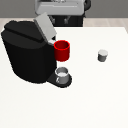
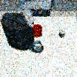
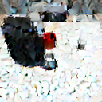

# Stem-OB: Generalizable Visual Imitation Learning with Stem-Like Convergent Observation through Diffusion Inversion

[Project Page](https://hukz18.github.io/Stem-OB/) | [Paper](https://arxiv.org/abs/2411.04919) | [Video](https://youtu.be/dgXJmaAETV0)

[](https://www.python.org/downloads/release/python-3124/)
[](https://arxiv.org/abs/2411.04919)
[](https://github.com/hukz18/DeFog/blob/master/LICENSE)

- [Overview](#overview)
- [Installation](#installation)
- [Usage](#usage)
- [Acknowledgments](#acknowledgments)
- [Citation](#citation)

# Overview


Visual imitation learning methods demonstrate strong performance, yet they lack generalization when faced with visual input perturbations like variations in lighting and textures. This limitation hampers their practical application in real-world settings. To address this, we propose Stem-OB that leverages the inversion process of pretrained image diffusion models to suppress low-level visual differences while maintaining high-level scene structures. This image inversion process is akin to transforming the observation into a shared representation, from which other observations also stem. Stem-OB offers a simple yet effective plug-and-play solution that stands in contrast to data augmentation approaches. It demonstrates robustness to various unspecified appearance changes without the need for additional training. We provide theoretical insights and empirical results that validate the efficacy of our approach in simulated and real settings. Stem-OB show an exceptionally significant improvement in real-world robotic tasks, where challenging light and appearance changes are present, with an average increase of 22.2% in success rates compared to the best baseline.

This repository contains the code for the Stem-OB inversion tools, which can be used to preprocess your visual imitation learning dataset using DDPM or DDIM inversion methods. The code also includes tools for inverting observations stored in HDF5 files, as well as visualizing the observations in the HDF5 files.

## Installation

To install Stem-OB, follow these steps:

```bash
conda create -n stem_ob python=3.12
conda activate stem_ob
pip install -r requirements.txt
```

## Usage
### Inversion for a single image
To perform inversion on a single image, run one of the following commands:

```bash
python invert.py --img_path figures/test.png --output_path figures/output.png --model ddpm # use DDPM, your output should look like figures/sample_ddpm.png
python invert.py --img_path figures/test.png --output_path figures/output.png --model ddim # use DDIM, your output should look like figures/sample_ddim.png
python invert.py --img_path figures/test.png --output_path figures/output.png --model ddpm --num_steps 50 --inversion_steps 10 # use DDPM with 50 total steps and 10 inversion steps
```
These commands support both DDPM and DDIM inversion metehods. Adjust the number of `--num_steps` and `--inversion_steps` as needed (ensure inversion_steps <= num_steps).

### Inversion for hdf5 file

To invert observations stored in an HDF5 file and save the results in a new HDF5 file:

```bash
python invert_hdf5.py --original_file datasets/demo.hdf5 --new_file datasets/demo_output.hdf5 --num_trajs 3 --obs_key base_camera
```
For this command, please download the demo hdf5 file from [here](https://drive.google.com/file/d/11UBiZ3SoHWjnlZ7jEtRwjSkcBLDRHuMG/view?usp=sharing) and put it in the `datasets` folder.

This command inverts the first 3 of trajectories in the `datasets/demo.hdf5` file, saving results to `datasets/demo_output.hdf5`. The complete list of arguments includes:
```
invert_hdf5.py 
--original_file ORIGINAL_FILE  # Path to the original HDF5 file
--new_file NEW_FILE            # Path to the output HDF5 file
--image_size IMAGE_SIZE        # Target image size
--num_trajs NUM_TRAJS          # Number of trajectories to invert
--obs_key OBS_KEY              # Key for observation data in HDF5 file
--model MODEL                  # Model to use (ddpm or ddim)
--num_steps NUM_STEPS          # Total steps for inversion
--inversion_steps INVERSION_STEPS  # Inversion steps (<= num_steps)
--batch_size batch_size        # batch size for batched processing, decrease this value if you run out of GPU memory
```
A sample HDF5 file `demo.hdf5` is provided in the datasets folder. The data structure is the same as those in the [RoboMimic](https://robomimic.github.io/docs/datasets/overview.html#dataset-structure). Adjust the HDF5 structure in `invert_hdf5.py` to read your custom HDF5 data structure.

### Visualizing the hdf5 file
```bash
python visualize_hdf5.py --input_hdf5_path datasets/demo.hdf5 --output_folder hdf5_images --demo demo_0 --obs_key base_camera
```
This command will visualize the observations of `demo_0` in the hdf5 file and save them in the output folder every 20 pictures. You can change the demo number and the observation key. All command line arguments are as follows:
```
visualize_hdf5.py 
--input_file INPUT_FILE       # path to the input hdf5 file
--output_folder OUTPUT_FOLDER # path to the output folder 
--demo DEMO                   # demo number to visualize
--obs_key OBS_KEY             # key of the observation in the hdf5 file

```
If you want to change the frequency of saving images, you can modify the code in the visualize_hdf5.py file.


## Sample Output

<div style="display: flex; justify-content: space-around;">
    
    
    
</div>

The left image is the original image, the middle image is the inverted image using DDPM, and the right image is the inverted image using DDIM.

# License

This project contains code licensed under both the MIT License and the Apache License 2.0.

The code developed for this project is licensed under the MIT License. This applies to all files outside of the `prompt_to_prompt` folder. You can find the full text of the MIT License in the LICENSE file at the root of this repository.

The `prompt_to_prompt` subfolder contains code licensed under the Apache License 2.0. This code has been included in accordance with the original licensing terms, and the Apache License 2.0 text can be found within.

# Acknowledgments
We thank [DDPM Inversion](https://github.com/inbarhub/DDPM_inversion) for their open source of DDPM inversion code, we also thank [RoboMimic](https://robomimic.github.io/) and [ManiSkill](https://www.maniskill.ai/home) for their open source of the imitation learning dataset.

# Citation
If you find this work useful, please consider citing our paper:

```
@misc{hu2024stemob,
      title={Stem-OB: Generalizable Visual Imitation Learning with Stem-Like Convergent Observation through Diffusion Inversion}, 
      author={Kaizhe Hu and Zihang Rui and Yao He and Yuyao Liu and Pu Hua and Huazhe Xu},
      year={2024},
      eprint={2411.04919},
      archivePrefix={arXiv},
      primaryClass={cs.RO},
      url={https://arxiv.org/abs/2411.04919}, 
}
```

